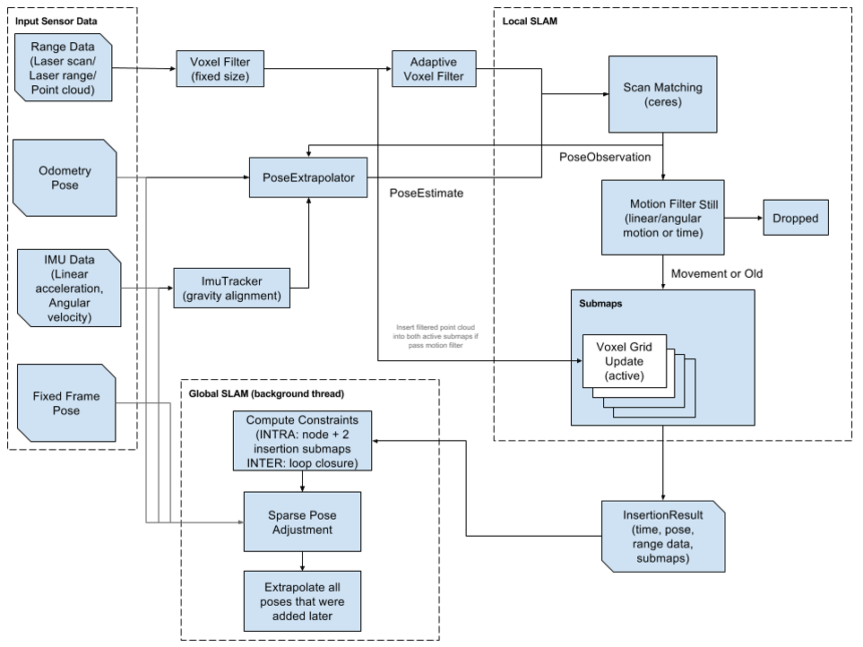

# 功能介绍

SLAM的全称是Simultaneous Localization And Mapping，即时定位与地图构建。简单来讲，就是机器人来到一个未知空间，自己在哪不知道，周围环境什么样之前也不知道，接下来需要通过自己的传感器逐步建立对环境的认知，并且确定自己实时所处的位置。

SLAM并不是指某一种具体的算法，而是一种技术，能够实现这种技术的算法有很多，本功能所使用的Cartographer是google推出的一套基于图优化的SLAM算法，可以实现机器人在二维或三维条件下的定位及建图功能，这套算法的主要设计目的是满足机器人在计算资源有限的情况下，依然可以实时获取较高精度的地图。


# 准备工作

本Node支持在实物机器人或Gazebo仿真环境中使用，在使用前请确认具备以下条件：

## 实物机器人

本Node在实物机器人上运行时，需要机器人具备以下基本条件：

- 机器人具备运动底盘、单线激光雷达、里程计及RDK套件，硬件已经连接并测试完毕；
- 已有ROS底层驱动，机器人可接收“/cmd_vel”指令运动
- PC电脑端已经完成Ubuntu、ROS Foxy/Humble的安装

机器人示例：

| 机器人名称          | 生产厂家 | 参考链接                                                     |
| :------------------ | -------- | ------------------------------------------------------------ |
| OriginBot智能机器人 | 古月居   | [点击跳转](https://www.originbot.org/)                       |
| X3派机器人          | 轮趣科技 | [点击跳转](https://item.taobao.com/item.htm?spm=a230r.1.14.17.55e556912LPGGx&id=676436236906&ns=1&abbucket=12#detail) |
| 履带智能车          | 微雪电子 | [点击跳转](https://detail.tmall.com/item.htm?abbucket=9&id=696078152772&rn=4d81bea40d392509d4a5153fb2c65a35&spm=a1z10.5-b-s.w4011-22714387486.159.12d33742lJtqRk) |
| RDK X3 Robot        | 亚博智能 | [点击跳转](https://detail.tmall.com/item.htm?id=726857243156&scene=taobao_shop&spm=a1z10.1-b-s.w5003-22651379998.21.421044e12Yqrjm) |


## Gazebo仿真

本Node在Gazebo仿真环境中运行时，需要具备以下基本条件：

- RDK套件
- PC电脑端已经完成ROS Gazebo及Turtlebot机器人相关功能包安装


# 使用方法

## 实物机器人

> 以下操作过程以OriginBot为例，满足条件的其他机器人使用方法类似

### 搭建机器人

参考机器人官网的[使用指引](https://www.originbot.org/guide/quick_guide/)，完成机器人的硬件组装、镜像烧写及示例运行，确认机器人的基础功能可以顺利运行。


### 安装Node

启动机器人后，通过终端或者VNC连接机器人，点击本页面右上方的“一键部署”按钮，复制如下命令在RDK的系统上运行，完成Node的安装：

```bash
sudo apt install -y tros-hobot-cartographer
```


### 运行Node

安装完成后，即可参考以下步骤运行该功能：

**1.启动机器人底盘**

启动机器人及激光雷达，如OriginBot的启动命令如下：

```bash
ros2 launch originbot_bringup originbot.launch.py use_lidar:=true
```


**2.启动cartographer**

启动一个新的终端，通过如下指令启动cartographer slam算法：

```bash
# 设置ros与tros的软链接
sudo python3 /opt/tros/create_soft_link.py --foxy /opt/ros/foxy/ --tros /opt/tros/

# 设置tros的环境变量
source /opt/tros/setup.bash

# 运行人体跟随
ros2 launch hobot_cartographer cartographer.launch.py
```


**3.查看SLAM动态效果**

为了便于查看SLAM的完整过程，在同一网络下的PC端，启动Rviz上位机可视化软件：

```bash
ros2 run rviz2 rviz2
```

启动成功后，分别添加Map、LaserScan、TF、RobotModel等显示项，即可看到当前建立的地图效果。


**4.遥控机器人建立地图**

为了让机器人建立周边环境的完整信息，我们还需要启动一个键盘控制节点：

```
sudo apt install ros-foxy-teleop-twist-keyboard
ros2 run teleop_twist_keyboard teleop_twist_keyboard
```

现在，我们就可以在键盘控制的终端中，点击键盘的上下左右键，控制机器人探索未知的环境啦，Rviz中会逐渐出现地图的全貌。


## Gazebo仿真

### 安装仿真环境

1. 参考[ROS2安装说明](https://docs.ros.org/en/humble/index.html)，在PC端的Ubuntu系统中安装ROS2

2. 在PC端的Ubuntu系统中安装Gazebo及机器人模型

```bash
sudo apt-get install ros-foxy-gazebo-*
sudo apt install ros-foxy-turtlebot3
sudo apt install ros-foxy-turtlebot3-bringup
sudo apt install ros-foxy-turtlebot3-simulations
sudo apt install ros-foxy-teleop-twist-keyboard
```

3. 确保使用的PC与RDK处于同一网络中


### 安装Node

启动RDK后，通过终端或者VNC连接RDK，点击本页面右上方的“一键部署”按钮，复制如下命令在RDK的系统上运行，完成Node的安装：

```bash
sudo apt install -y tros-hobot-cartographer
```


### 运行Node

安装完成后，即可参考以下步骤运行该功能：

**1.启动仿真环境**

在PC端Ubuntu的终端中使用如下命令启动Gazebo，并加载机器人模型：

```bash
# 根据所使用的ROS版本修改此处的路径
source /opt/ros/foxy/setup.bash

export TURTLEBOT3_MODEL=burger
ros2 launch turtlebot3_gazebo turtlebot3_world.launch.py
```

启动成功后的Gazebo仿真环境如下：


**2.启动cartographer**

在RDK的系统中，启动终端，通过如下指令启动cartographer slam算法：

```bash
# 设置ros与tros的软链接
sudo python3 /opt/tros/create_soft_link.py --foxy /opt/ros/foxy/ --tros /opt/tros/

# 设置tros的环境变量
source /opt/tros/setup.bash

# 运行人体跟随
ros2 launch hobot_cartographer cartographer.launch.py use_sim_time:=True
```


**3.查看SLAM动态效果**

为了便于查看SLAM的完整过程，在同一网络下的PC端，启动Rviz上位机可视化软件：

```bash
ros2 run rviz2 rviz2
```

启动成功后，分别添加Map、LaserScan、TF、RobotModel等显示项，即可看到当前建立的地图效果。


**4.遥控机器人建立地图**

为了让机器人建立周边环境的完整信息，我们还需要启动一个键盘控制节点：

```
ros2 run teleop_twist_keyboard teleop_twist_keyboard
```

现在，我们就可以在键盘控制的终端中，点击键盘的上下左右键，控制机器人探索未知的环境啦，Rviz中会逐渐出现地图的全貌。


# 接口说明


## 话题

| 名称  | 消息类型                | 说明 |
| ----- | ----------------------- | ---- |
| /map  | geometry_msgs/msg/Twist |      |
| /odom |                         |      |
| /scan |                         |      |
| /tf   |                         |      |


## 参数

| 名称               | 类型 | 默认值 | 取值范围 | 说明 |
| ------------------ | ---- | ------ | -------- | ---- |
| map_frame          |      |        |          |      |
| tracking_frame     |      |        |          |      |
| published_frame    |      |        |          |      |
| odom_frame         |      |        |          |      |
| provide_odom_frame |      |        |          |      |
| use_odometry       |      |        |          |      |
| min_range          |      |        |          |      |
| max_range          |      |        |          |      |


# 原理简介

Cartographer算法主要分为两个部分，第一个部分称为Local SLAM, 也就是之前我们说的SLAM前端，这个部分会基于激光雷达信息建立并维护一系列的子图Submap，这些子图就是一系列之前Gmapping中提到的栅格地图。每当有新的雷达数据输入进来，系统就会通过一些匹配算法将其插入到子图的最佳位置。



但是子图会产生累积误差，所以算法的第二个部分，也就是这个Global SLAM，是SLAM算法的后端，它的主要功能就是通过闭环检测来消除累积误差，每当一个子图构建完成后，就不会再有新的雷达数据插入这个子图中，算法也会将这个子图加入到闭环检测中。

总体而言，Local SLAM生成一个一个的拼图块，而Global SLAM完成整个拼图。


# 参考资料

- Cartographer官方文档：[点击跳转](https://google-cartographer.readthedocs.io/en/latest/)


# 常见问题

暂无

