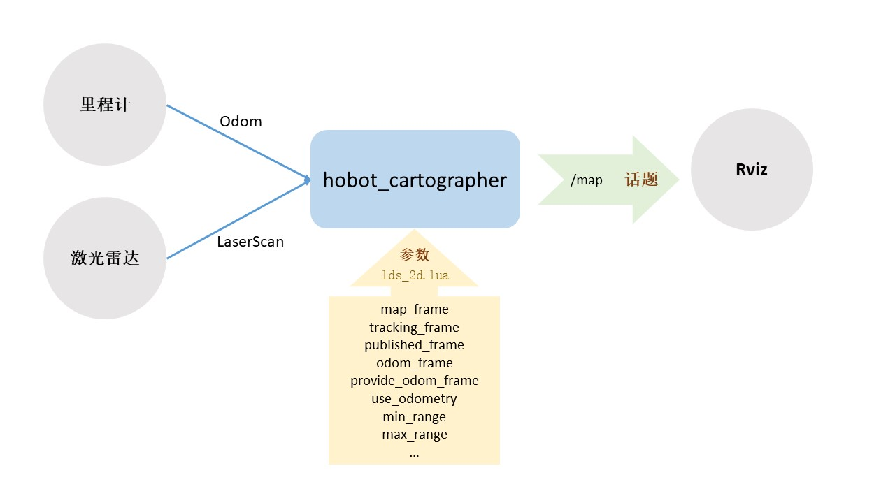

# 功能介绍

SLAM的全称是Simultaneous Localization And Mapping，即时定位与地图构建。简单来讲，就是机器人来到一个未知空间，自己在哪不知道，周围环境什么样之前也不知道，接下来需要通过自己的传感器逐步建立对环境的认知，并且确定自己实时所处的位置。

SLAM并不是指某一种具体的算法，而是一种技术，能够实现这种技术的算法有很多，本功能所使用的Cartographer是google推出的一套基于图优化的SLAM算法，可以实现机器人在二维或三维条件下的定位及建图功能，这套算法的主要设计目的是满足机器人在计算资源有限的情况下，依然可以实时获取较高精度的地图。该功能支持机器人实物和Gazebo仿真两种体验方式。

# 物料清单

以下机器人均已适配RDK X3

| 机器人名称          | 生产厂家 | 参考链接                                                     |
| :------------------ | -------- | ------------------------------------------------------------ |
| OriginBot智能机器人 | 古月居   | [点击跳转](https://www.originbot.org/)                       |
| X3派机器人          | 轮趣科技 | [点击跳转](https://item.taobao.com/item.htm?spm=a230r.1.14.17.55e556912LPGGx&id=676436236906&ns=1&abbucket=12#detail) |
| 履带智能车          | 微雪电子 | [点击跳转](https://detail.tmall.com/item.htm?abbucket=9&id=696078152772&rn=4d81bea40d392509d4a5153fb2c65a35&spm=a1z10.5-b-s.w4011-22714387486.159.12d33742lJtqRk) |
| RDK X3 Robot        | 多厂家 | [点击跳转](https://developer.horizon.ai/sunrise) |

# 使用方式

## 准备工作

1. 机器人具备运动底盘、相机及RDK套件，硬件已经连接并测试完毕；
2. 已有ROS底层驱动，机器人可接收“/cmd_vel”指令运动，并根据指令正确运动；
3. 已安装Lidar驱动，能够正常发布/scan话题；
4. PC电脑端已经完成Ubuntu、ROS Foxy/Humble的安装。


## 安装hobot-cartographer功能包

启动机器人后，通过终端或者VNC连接机器人，点击[NodeHub hobot-cartographer](http://it-dev.horizon.ai/nodehubDetail/170117036053371409)右上方的“一键部署”按钮，复制如下命令在RDK的系统上运行，完成人体跟随相关Node的安装。

```bash
sudo apt update
sudo apt install -y tros-hobot-cartographer
```

## 运行cartographer

这里以OriginBot为例，不同品类机器人前面三步执行命令可能有所差别

**1.启动机器人底盘**

启动机器人，通过终端或者VNC连接机器人，OriginBot的启动命令如下：

```bash
# 设置tros的环境变量
source /opt/tros/setup.bash

# 设置ros的环境变量
source /opt/ros/foxy/setup.bash

# 启动OriginBot
ros2 launch originbot_base robot.launch.py 
```

**2.启动激光雷达**

通过终端或者VNC连接机器人，激光雷达启动命令如下：

```bash
# 设置tros的环境变量
source /opt/tros/setup.bash

# 设置ros的环境变量
source /opt/ros/foxy/setup.bash

# 运行激光雷达
ros2 launch ydlidar_ros2_driver ydlidar_launch.py
```

**3.启动cartographer**

通过终端或者VNC连接机器人，cartographer启动命令如下：

```bash
# 设置tros的环境变量
source /opt/tros/setup.bash

# 设置ros的环境变量
source /opt/ros/foxy/setup.bash

# 运行cartographer
ros2 launch hobot_cartographer cartographer.launch.py
```

**4.查看SLAM动态效果**

为了便于查看SLAM的完整过程，在同一网络下的PC端，启动Rviz上位机可视化软件：

```bash
ros2 run rviz2 rviz2
```

启动成功后，分别添加Map、LaserScan、TF、RobotModel等显示项，即可看到当前建立的地图效果。


**5.遥控机器人建立地图**

为了让机器人建立周边环境的完整信息，我们还需要启动一个键盘控制节点：

```bash
# 设置tros的环境变量
source /opt/tros/setup.bash

# 设置ros的环境变量
source /opt/ros/foxy/setup.bash

ros2 run teleop_twist_keyboard teleop_twist_keyboard
```

现在，我们就可以在键盘控制的终端中，点击键盘的上下左右键，控制机器人探索未知的环境啦，Rviz中会逐渐出现地图的全貌。

**6.保存地图**

建图完成后，可以使用如下指令将地图保存在当前路径下：

```bash
# 安装tros-hobot-nav2
sudo apt install -y tros-hobot-nav2

# 设置tros的环境变量
source /opt/tros/setup.bash

# 设置ros的环境变量
source /opt/ros/foxy/setup.bash

ros2 run nav2_map_server map_saver_cli -f my_map --ros-args -p save_map_timeout:=10000
```


# 接口说明



## 话题

### 订阅话题

| 名称  | 消息类型                | 说明 |
| ----- | ----------------------- | ---- |
| /imu  | sensor_msgs/msg/Imu        | 惯导数据    |
| /odom |  nav_msgs/msg/Odometry     | 里程计信息     |
| /scan | sensor_msgs/msg/LaserScan  | 激光雷达数据     |

### 发布话题

| 名称  | 消息类型                | 说明 |
| ----- | ----------------------- | ---- |
| /submap_list  | cartographer_ros_msgs/msg/SubmapList | submap列表    |
| /map |  nav_msgs/msg/OccupancyGrid     | 地图数据     |

## 参数

参数意义及调整方式可参考[cartographer调参说明](https://google-cartographer-ros.readthedocs.io/en/latest/algo_walkthrough.html)


# 参考资料

- Cartographer官方文档：[点击跳转](https://google-cartographer.readthedocs.io/en/latest/)


# 常见问题

暂无

